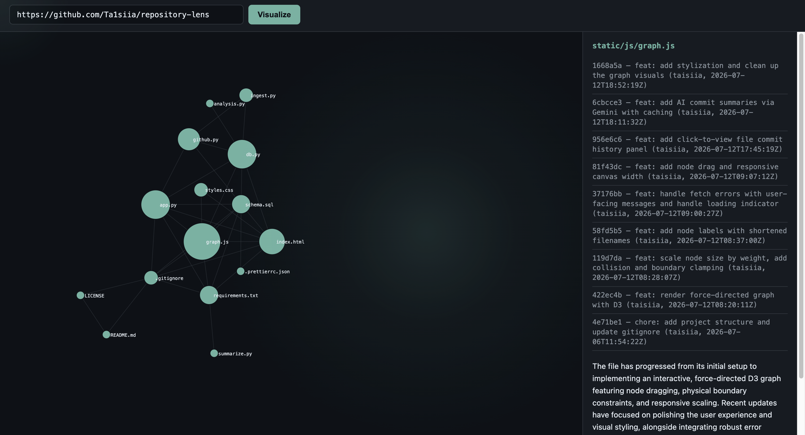

# Repository Lens

Paste a public GitHub repository URL and get an interactive force-directed graph
of its codebase: node size reflects how often a file changes, edges connect
files that tend to change together. Click a file to see its recent commit
history and an AI-generated summary of its evolution.

## Video Demo


## What it does

Repository Lens turns raw commit history into a visual map of how a codebase
actually evolves — not its folder structure, but which files change _together_.
That reveals things a file tree can't: hidden coupling between files in
different directories, which parts of the codebase are actively churning, and
which files are edited in isolation.



- **Node size** = how often the file appears in commits (activity)
- **Edges** = how often two files are changed in the same commit (co-change)
- **Click any node** to see its last 10 commits and an AI-written paragraph
  summarizing what's been happening in that file

## How it works

1. **Ingest** — fetches commit history for the given repo via the GitHub REST
   API (paginated, parallelized with a thread pool), caches everything in
   SQLite. Repeat visits only fetch commits since the last sync.
2. **Co-change analysis** — walks the cached commit/file data, canonicalizes
   file renames across history so a renamed file doesn't fracture into two graph
   nodes, and counts which file pairs are modified together. Very large commits
   (mass renames, formatting sweeps) are excluded from edge counting to avoid
   noisy false co-change signals.
3. **Graph rendering** — the co-change data is sent to the browser and rendered
   as a D3.js force-directed graph: node radius scales with commit frequency,
   edges pull related files together, physics keep the layout readable. The
   graph supports zoom, pan, and drag.
4. **Commit history + summary** — clicking a node fetches that file's recent
   commits from the cache, and its commit messages are sent to Google's Gemini
   API to generate a short summary of the file's recent history. Summaries are
   cached and only regenerated when the file gets new commits.

## Files

**`app.py`** — Flask application and routing. Defines three endpoints: `/graph`
(parses the submitted URL, triggers a re-ingest if the repo's HEAD has moved
since the last visit, returns the co-change graph as JSON), `/commits` (returns
a file's recent commit history from the cache), and `/summary` (returns a cached
AI summary, or generates and caches a new one if the file has new commits since
the last summary). Also contains `parse_github_url()`, which normalizes several
acceptable input formats (`owner/repo`, `github.com/owner/repo`, a full
`https://github.com/owner/repo` URL, with or without a trailing `.git`) into a
single `(owner, name)` pair.

**`db.py`** — All SQLite access lives here; no other file executes raw SQL.
Includes connection setup (with foreign keys explicitly enabled, since SQLite
disables them by default per connection), functions to read and write commits
and their file changes, repo lookup/creation, the sync-timestamp cache check
that `/graph` uses to decide whether to re-ingest, and get/save functions for
cached AI summaries. Saving a summary uses SQLite's `ON CONFLICT ... DO UPDATE`
(upsert) syntax, since a file's summary needs to be _replaced_, not duplicated,
once it gets new commits.

**`github.py`** — All communication with the GitHub REST API. Handles
authenticated requests, paginating through a repository's commit list (GitHub
returns commits in pages of up to 100, linked via a `Link` response header), and
fetching full detail for a single commit (message, author, timestamp, and the
list of files it touched, including renames).

**`ingest.py`** — Orchestrates pulling a repository's commit history into the
database. Fetches the list of commit SHAs, filters out any already in the
database, then fetches full detail for the remaining commits concurrently using
a thread pool (since each fetch is an independent network request), and writes
the results to the database sequentially afterward, since SQLite only supports
one writer at a time. This two-phase design (parallel fetch, then sequential
write) cut ingest time for a mid-sized repository from several minutes to under
a minute in testing.

**`analysis.py`** — The core algorithm: turning raw commit/file data into a
co-change graph. `build_rename_map()` walks a repository's rename history so
that a file renamed multiple times (A → B → C) still counts as one node instead
of fracturing the graph into disconnected pieces. `build_graph()` counts how
often each file appears across commits (node weight) and how often each pair of
files appears together in the same commit (edge weight), excluding very large
commits (mass renames, formatting sweeps) from edge counting since they create
noisy, meaningless co-change signals between files that don't actually work
together.

**`summarize.py`** — Sends a file's recent commit messages to Google's Gemini
API and returns a short natural-language summary of what's been happening in
that file.

**`templates/index.html`** — The single HTML page: a form for submitting a
repository URL, and containers for the graph and the detail panel.

**`static/js/graph.js`** — All frontend logic. Handles form submission and API
calls, trims the graph to its 40 highest-activity nodes before rendering (a full
graph on a large repository would be unreadably dense), converts the API
response into the shape D3 expects, and builds the force-directed graph itself:
node radius scaled by commit frequency, physics forces tuned to keep node labels
from overlapping, drag-to-reposition, zoom/pan, and click-to-open the detail
panel.

**`static/css/style.css`** — Dark theme styled after developer tools (monospace
type for file names and commit data, a muted palette built around the graph's
accent color), and the two-column layout (graph left, detail panel right).

**`db/schema.sql`** — SQLite schema: four tables (`repos`, `commits`,
`commit_files`, `summaries`) with foreign key constraints and `STRICT` typing.

## Design decisions

**Gemini instead of Claude Haiku for summaries.** The original plan used
Anthropic's Haiku model, but the Anthropic API requires a funded account with no
free tier. Google's Gemini API offers a genuinely free tier (no card, generous
daily quota) suited to occasional summary generation, so the summary feature was
built against Gemini instead. The rest of the pipeline (ingest, co-change
analysis, graph rendering) is provider-agnostic either way.

**No user-supplied GitHub token field.** The original spec included an optional
field letting visitors supply their own PAT to raise their rate limit. This was
cut for MVP: the app runs on a developer-supplied token (5,000 requests/hour),
which is enough for normal use, and a visitor's own rate limit only becomes a
real constraint under heavy sustained traffic.

**Top-40 node limit on the frontend.** Large repositories can have thousands of
files in their co-change graph. The frontend trims to the 40 highest-activity
nodes (and drops edges referencing anything outside that set) before rendering,
since a full unfiltered graph on something like a large monorepo would be
unreadable and slow to render regardless of layout quality.

## Tech Stack

- **Backend:** Python, Flask
- **Database:** SQLite
- **Frontend:** vanilla HTML/CSS/JavaScript, D3.js (force-directed graph)
- **APIs:** GitHub REST API, Google Gemini API (commit summaries)

## Setup

1. Clone the repo and create a virtual environment:

```bash
   git clone
   cd repository-lens
   python -m venv venv
   source venv/bin/activate  # Windows: venv\Scripts\activate
   pip install -r requirements.txt
```

2. Create a `.env` file in the project root with two keys:
   GITHUB_PAT=your_github_personal_access_token
   GEMINI_API_KEY=your_gemini_api_key
   - GitHub PAT:
     [github.com/settings/tokens](https://github.com/settings/tokens) (no
     special scopes needed for public repos — this just raises the rate limit
     from 60 to 5,000 requests/hour)
   - Gemini API key: [aistudio.google.com](https://aistudio.google.com) (free
     tier, no card required)

3. Run it:

```bash
   flask run
```

Visit `http://127.0.0.1:5000`, paste a public GitHub repo URL, click Visualize.

## Deployment

To deploy this project run

```bash
  npm run deploy
```

## Known limitations

- **First visit to a new repo is slow.** Ingesting a repo's commit history for
  the first time can take 30-60+ seconds depending on size. Repeat visits are
  fast (cached). There's a loading indicator, but no background pre-fetching.
- **`MAX_COMMITS = 400`.** Only the most recent 400 commits per repo are
  analyzed, to keep ingest time and graph size reasonable. Very old co-change
  patterns won't show up.
- **Rename history before a rename isn't shown in the commit panel.** The commit
  history panel looks up commits by the file's _current_ name, so history from
  before a rename won't appear there (it is still counted correctly in the
  co-change graph itself).
- **No dependency graphs, diffs, private-repo support, or team analytics.**
  Explicitly out of scope for this project.
- On Render's free tier, very large repositories (e.g., facebook/react) may time out during first-visit ingest due to limited CPU — smaller/medium repos ingest reliably within 1-2 minutes.
  This is a hosting-tier constraint, not an application limit; ingest completes normally with more CPU (e.g., local development, or a paid Render tier).

## AI use

This project was built with Claude as a coding assistant throughout development.
Per-block disclosure of AI-assisted code is included as comments in the source
files. Claude was used for: explaining unfamiliar concepts (D3.js force
simulations, GitHub API pagination), reviewing code for bugs, and drafting a
small number of specific algorithm blocks (noted individually in-code) that were
then reviewed and adjusted. Overall architecture, the co-change algorithm
design, and the majority of implementation were written independently.
